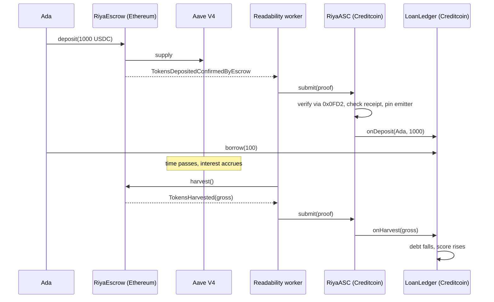

# riya

> Put dollars to work on Ethereum, borrow against them on Creditcoin, and let the
> yield repay the loan. No bridge, no oracle, no trusted relayer.

**Creditcoin Hackathon** · Attestcoin readability · Built on the Block Prover Precompile (`0x0FD2`)

[Deployed contracts](#deployments) · [Proof it ran](#proof-it-ran) · [Walkthrough](walkthrough/)

---

## The problem

Self-repaying loans work. Alchemix proved it: deposit collateral, borrow against
it, and let the yield retire the debt while you do nothing.

They only work on one chain at a time. The lender has to *see* the yield arrive,
and a contract on Creditcoin cannot see an Ethereum transaction. Today that gap
is closed by bridges and oracles — a multisig, a committee, or a price feed you
have to trust. Each one is a party that can lie, stall, or be drained.

So the yield stays on the chain that earns it, and the credit exists nowhere.

## How it works

Ada has $1,000 of USDC and wants cash without selling.

1. **She deposits.** $1,000 goes into `RiyaEscrow` on Ethereum, which puts it
   straight into Aave V4. The escrow keeps no accounting of its own — it takes
   custody, emits one event, and that is the entire contract.
2. **The deposit is proven.** A permissionless worker fetches an inclusion proof
   and calls `RiyaASC.submit` on Creditcoin. Creditcoin re-checks the Ethereum
   block itself through the Block Prover Precompile. No committee sits in
   between.
3. **She borrows $100.** New addresses open at a 10% limit and mint rUSD against
   the collateral — an ordinary ERC-20 any Creditcoin wallet or contract accepts.
4. **The position earns.** Aave pays roughly 5% a year. Because Aave positions
   rebase silently, `harvest()` pulls the profit out in a real transaction,
   turning continuous interest into a discrete, provable fact.
5. **Each harvest is proven and retires debt.** Creditcoin verifies the harvest
   the same way it verified the deposit, takes a 15% fee, and spreads the rest
   across open positions. Ada's debt falls. She signs nothing.
6. **Her limit rises.** Only yield-retired debt moves the credit score, so the
   ladder measures productive collateral rather than activity.
7. **The debt reaches zero.** Ada never repaid a cent.



## What makes this different

- **The chain verifies the proof, not a committee.** `RiyaASC` calls the Block
  Prover Precompile directly. A bridge asks you to trust its validators; here
  Creditcoin re-runs the inclusion check itself.
- **Three checks the precompile does not make.** It answers one question — is
  this transaction in a real block? It does not say the transaction succeeded,
  that you have not already acted on it, or who emitted the logs inside it.
  `submit` adds all three, and dropping any one makes the protocol drainable.
- **The emitter pin is demonstrated, not asserted.** Event signatures are
  public, so anyone can emit `TokensHarvested` with a value of one billion and
  obtain a *genuine* proof for it. `make attack` does exactly that on live
  Sepolia; `RiyaASC` rejects it on `log.address_`, the one field a forger cannot
  control.
- **Nothing waits on writability.** Every proof travels inbound. Creditcoin's
  outbound leg is still in third-party audit, and no part of this product needs
  it — the position living on Creditcoin is the point, not a waypoint.
- **The credit score cannot be bought.** Cash repayment deliberately does not
  touch `s_repaidByYield`. Borrow $100 and repay $100 on a loop and the score
  stays at zero, because only proven yield counts.

## Architecture

Two chains. Ethereum holds the money and states facts; Creditcoin decides what
they mean. State exists in exactly one place, so a whole class of desync bugs
never gets written.

### Ethereum Sepolia

**[`RiyaEscrow`](https://github.com/Kelechikizito/riya/blob/2a5e3a513ac92fd29742eb6f87cc57dc083f016c/src/source-chain/ethereum/RiyaEscrow.sol#L76-L100)**
takes custody and emits the deposit event Creditcoin proves against. It holds no
balance of its own and does no accounting.

**[`AaveV4Adapter`](https://github.com/Kelechikizito/riya/blob/2a5e3a513ac92fd29742eb6f87cc57dc083f016c/src/adapters/AaveV4Adapter.sol#L139-L145)**
supplies to Aave and skims yield.
[`yieldAccrued()`](https://github.com/Kelechikizito/riya/blob/2a5e3a513ac92fd29742eb6f87cc57dc083f016c/src/adapters/AaveV4Adapter.sol#L219-L223)
is holdings minus principal, clamped at zero. `harvest()` is permissionless and
pays its caller nothing, so if the operator disappears anyone can keep the loans
repaying themselves.

### Creditcoin Testnet

**[`RiyaASC`](https://github.com/Kelechikizito/riya/blob/2a5e3a513ac92fd29742eb6f87cc57dc083f016c/src/destination-chain/RiyaASC.sol#L149-L182)**
is the only door between the chains. `submit` runs four steps in order: derive a
replay key from chain, height, root and transaction index; verify against the
precompile; require `receiptStatus == 1`; dispatch. The replay key is written
*before* verification, which is safe for one reason — step 2 reverts. A
non-reverting failure would poison the key and permanently block the real proof.

[`_dispatch`](https://github.com/Kelechikizito/riya/blob/2a5e3a513ac92fd29742eb6f87cc57dc083f016c/src/destination-chain/RiyaASC.sol#L200-L250)
pins every log to the contract allowed to emit it, and *skips* impostor logs
rather than reverting. Reverting would let anyone plant a decoy beside a genuine
event and make the real one permanently unprovable.

**[`LoanLedger`](https://github.com/Kelechikizito/riya/blob/2a5e3a513ac92fd29742eb6f87cc57dc083f016c/src/destination-chain/LoanLedger.sol#L164-L172)**
holds every decision. `onHarvest` moves one protocol-wide accumulator instead of
looping over borrowers, and
[`_settle`](https://github.com/Kelechikizito/riya/blob/2a5e3a513ac92fd29742eb6f87cc57dc083f016c/src/destination-chain/LoanLedger.sol#L235-L260)
applies a borrower's share when they next touch the contract. The
[LTV ladder](https://github.com/Kelechikizito/riya/blob/2a5e3a513ac92fd29742eb6f87cc57dc083f016c/src/destination-chain/LoanLedger.sol#L306-L313)
runs 10% → 20% → 30% → 40% → 50%.

**[`RiyaUSD`](https://github.com/Kelechikizito/riya/blob/2a5e3a513ac92fd29742eb6f87cc57dc083f016c/src/destination-chain/RiyaUSD.sol#L101-L103)**
is the borrowable dollar, 6 decimals to match USDC. Supply deliberately does not
track debt: settlement from yield burns nothing, so supply is outstanding debt
plus debt already retired. It is a dollar-denominated credit token, not a
stablecoin — there is no peg and no arbitrage path to close one.

### Off-chain

`offchain/src/worker.ts` watches Ethereum, waits for Creditcoin to attest the
block, builds the proof and submits it. It separates permanent failures from
retriable ones and dead-letters the permanent set, because retrying
`RiyaASC__NoRelevantLog` forever blocks every later event behind it. Its replay
key derivation is pinned to the contract's by test.

## Deployments

### Creditcoin Testnet (chain 102031)

| Contract | Address |
|---|---|
| `LoanLedger` | [`0x551904…9E86`](https://creditcoin-testnet.blockscout.com/address/0x551904f44630B7C2ac9BBf81db795928Cc329E86) |
| `RiyaASC` | [`0xce0c01…aBC7`](https://creditcoin-testnet.blockscout.com/address/0xce0c01B9c2E407af328eB25D06aea0f1929aaBC7) |
| `RiyaUSD` | [`0x194b05…3335`](https://creditcoin-testnet.blockscout.com/address/0x194b050678eb50923b84fE5aDC8E6f8176D43335) |

### Ethereum Sepolia

| Contract | Address |
|---|---|
| `RiyaEscrow` | [`0xEDe17e…b72e`](https://sepolia.etherscan.io/address/0xEDe17e550D36597CA497356DBE2CfCebC876b72e) |
| `AaveV4Adapter` | [`0x83142d…8bFb`](https://sepolia.etherscan.io/address/0x83142d63752E09490c4FfCd2482568a7c8618bFb) |
| `MockAaveSpoke` | [`0xf0f1ea…3064`](https://sepolia.etherscan.io/address/0xf0f1ea77A624382C3656aE5C4d93dBfEC59e3064) |
| `MockUSD` | [`0xcA1BA8…318F`](https://sepolia.etherscan.io/address/0xcA1BA8049f1e29c07f539C7c918dcc1D57BF318F) |

Aave V4 is deployed on Ethereum Mainnet and nowhere else, so Sepolia runs against
a stand-in. The adapter is tested against the real Spoke on a mainnet fork.

## Proof it ran

One complete cycle on live testnets. Every row is independently verifiable.

| Step | Chain | Transaction |
|---|---|---|
| Deposit into the escrow | Sepolia | [`0x5a6b48…a4eb`](https://sepolia.etherscan.io/tx/0x5a6b48219b8a7f47605a0a03d41bf2858bd04ad6d0fa8c8bf4efc775fcc6c63b) |
| That deposit proven, collateral credited | Creditcoin | [`0x2d3ee3…c080`](https://creditcoin-testnet.blockscout.com/tx/0x2d3ee358f756371e3630dd2b4afe91268b8d6acbdcfda722550893c79d2cc080) |
| Borrow rUSD against it | Creditcoin | [`0xd943f5…469e`](https://creditcoin-testnet.blockscout.com/tx/0xd943f5685c23d7b173513826a24a8fbfddb907cb0f80f52a5e261e0ac534469e) |
| Harvest the Aave yield | Sepolia | [`0x4f08ec…0c00`](https://sepolia.etherscan.io/tx/0x4f08ec2bd9b2354da4512309a84871649ab0759d73321dea2f2efa15f0f10c00) |
| That harvest proven, yield distributed | Creditcoin | [`0x12d23f…c861`](https://creditcoin-testnet.blockscout.com/tx/0x12d23f5fb72f3a89cd23a01429d4e93ae90a2744680e62e1151dbf3f2e36c861) |
| **Debt retired by proven yield** — `DebtRetired(applied 200000000, surplus 54999999)` | Creditcoin | [`0x5b661c…3fed`](https://creditcoin-testnet.blockscout.com/tx/0x5b661cbd092ee97d8292764538d01c0fbe4558388b872e43547bda6ac4923fed) |

**Ten proofs have been verified on Creditcoin so far** — five deposits, five
harvests — none of them carried by a bridge or a relayer with special rights.

Live ledger state after the last harvest:

| | |
|---|---|
| Total collateral | $4,100.00 |
| Debt retired by yield | **$200.00** |
| Credit score | **25**, up from 0 |
| Borrow limit | **20%**, one tier up the ladder |
| Protocol fees accrued | $75.00 |

The score is not a mock. It moved because proven yield retired real debt.

## Quick start

```bash
git clone https://github.com/Kelechikizito/riya.git
cd riya
make install && make build
make test                 # 179 tests
```

To run against live testnets, copy `.env.example` to `.env`, fill in the
endpoints, then:

```bash
make senders              # print the three keystore addresses
make preflight            # check balances before spending gas
make deploy-mocks         # Sepolia: demo dollar and Aave stand-in
make deploy-source        # Sepolia: escrow + adapter
make deploy-destination   # Creditcoin: token, ASC, ledger
make worker               # leave running — this is what carries proofs
```

> Keys live in Foundry's encrypted keystore, never in `.env`. `--sender` is
> required alongside `--account`, because the deploy scripts predict nonces
> against that address during simulation, before the keystore is unlocked.

The frontend is a separate workspace:

```bash
cd frontend && npm install && npm run dev
```

Addresses and ABIs are generated into `frontend/lib/contracts/` from `out/` and
`deployments/` by `make frontend-contracts`, so the app builds with no Foundry
toolchain present and cannot drift from what is deployed.

## Testing

```
179 tests passing across 15 suites
```

| Suite | Tests | Covers |
|---|---|---|
| `LoanLedgerTest` · `LoanLedgerFuzz` | 47 | accounting, the ladder, settlement |
| `ScriptsTest` · `DeployScriptsTest` · `HelperConfigTest` | 39 | deploy predictions, chain config, interactions |
| `RiyaASCTest` · `RiyaASCFuzz` | 33 | replay, receipt status, the emitter pin |
| `SourceChainFuzz` · `AaveV4AdapterTest` · `RiyaEscrowTest` | 29 | custody and yield measurement |
| `RiyaEndToEndTest` · `LocalSourceChainTest` | 11 | deposit → prove → borrow → harvest → retire |
| `CreditcoinTestnetForkTest` | 10 | assumptions checked against the live chain |
| `RiyaUSDTest` · `RiyaEscrowMainnetTest` | 10 | mint/burn authority, real Aave V4 on a fork |

The fuzz suites state properties, not examples. In plain English:

- Settling twice changes nothing
- A deposit never raises the credit score
- Debt never exceeds half the collateral, at any tier
- No impostor contract can create collateral or distribute yield
- A reverted source-chain transaction never applies
- Pending yield always equals what settlement actually applies
- The pro-rata split never overpays

The fork suite talks to Creditcoin Testnet over RPC and fails if the live chain
registry disagrees with the hardcoded keys — Sepolia is `1`, Ethereum Mainnet is
`3`. It fails loudly rather than skipping when `CREDITCOIN_RPC_URL` is unset,
because a green run that quietly covered less than it claimed is worse than a red
one.

## Known issues

**Protocol fees accrue but cannot be collected.** `s_protocolFees` is a number on
Creditcoin representing a claim on USDC held in the Ethereum escrow. Paying it
out means moving money from Ethereum, which needs the outbound leg. A fix exists
that needs no writability — mint the fee as rUSD against the 15% of each harvest
that lands in the escrow undistributed — but it is not built, and until it is the
number is an IOU.

**If Aave is impaired, the protocol absorbs it.** Yield is measured as holdings
minus principal. If the reserve takes a loss, collateral shrinks while the
Creditcoin debt does not, and there is no liquidation path. The designed answer
is to prove the shortfall the same way yield is proven, absorb it from accrued
fees, then socialise the remainder — which prices a loss but cannot refund one.
Designed, not built.

**Settlement is lazy, so a borrower's stored debt reads stale.** `onHarvest`
moves one accumulator rather than looping over every borrower, which is the only
way the gas stays bounded as the protocol grows. A borrower's `s_debt` updates
when they next touch the contract. The UI subtracts `pendingYield()` to show the
settled figure, and a one-click `repay(1)` makes it real on chain.

**Proofs are not instant.** A deposit is credited once its Ethereum block is
attested, not the moment it lands. Measured at three to four minutes on testnet.

## Track alignment

| Criterion | Where it is satisfied |
|---|---|
| **Technical Alignment** | `submit` verifies against the Block Prover Precompile and adds the replay-key, receipt-status and emitter checks the precompile does not make — [`RiyaASC.sol#L149-L182`](https://github.com/Kelechikizito/riya/blob/2a5e3a513ac92fd29742eb6f87cc57dc083f016c/src/destination-chain/RiyaASC.sol#L149-L182) |
| **Proven Models** | Alchemix's self-repaying loan and a Synthetix-style reward accumulator, adapted to proven cross-chain state — [`LoanLedger.sol#L235-L260`](https://github.com/Kelechikizito/riya/blob/2a5e3a513ac92fd29742eb6f87cc57dc083f016c/src/destination-chain/LoanLedger.sol#L235-L260) |
| **User Base Expansion** | rUSD is a plain ERC-20 on Creditcoin, and the credit score is a public read other protocols can price against — [`LoanLedger.sol#L291-L313`](https://github.com/Kelechikizito/riya/blob/2a5e3a513ac92fd29742eb6f87cc57dc083f016c/src/destination-chain/LoanLedger.sol#L291-L313) |
| **Execution Capability** | 179 tests, a live two-chain deployment, ten verified proofs, and a reproducible three-step deploy with post-deploy address assertions |
| **Product Vision** | Phases 0–2 need nothing that does not exist today; Phase 3 is labelled blocked on protocol capability rather than promised |

## Tech stack

Solidity 0.8.30 and Foundry. OpenZeppelin for ERC-20 and `ReentrancyGuard`. Aave
V4 as the yield venue. `@gluwa/usc-contracts` for the precompile interfaces and
`@gluwa/usc-sdk` for proof building. TypeScript, ethers v6 and SQLite for the
worker and keeper. Next.js 16, wagmi and viem for the frontend, with Playwright
driving end-to-end tests against the live deployment.

## What I'd build next

**Mint the protocol fee as rUSD to a treasury.** It turns the one part of the
business model that currently cannot be collected into a spendable balance on day
one, and it needs no capability that does not already exist.

**Prove impairment inbound.** The adapter already knows when holdings fall below
principal and throws that number away. Emitting and proving it is the same
machinery as yield with the sign flipped, and it closes the protocol's real risk.

**Permissionless watchers.** `harvest()` and `submit` are already open to anyone;
what is missing is an incentive to run the worker. Until then a stalled operator
delays proofs, even though nobody can forge them.

**More collateral assets behind `IYieldAdapter`.** The interface exists and the
escrow already routes through it. The blocker is pricing — the ledger counts
collateral in dollars, and anything that is not a dollar needs an oracle.

## License

MIT.

---

Built for the Creditcoin Hackathon by [Kelechi Kizito Ugwu](https://github.com/Kelechikizito).
The [walkthrough](walkthrough/) documents the build checkpoint by checkpoint, with
the reasoning behind each decision.
